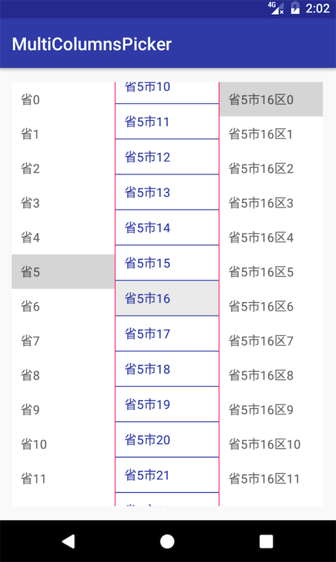
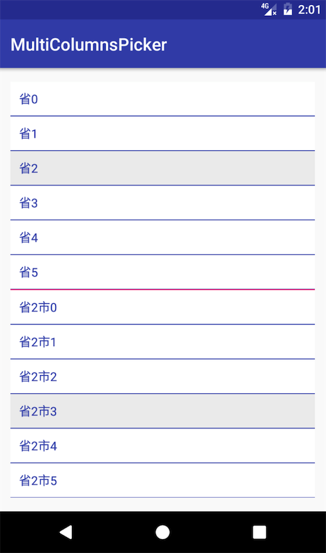

# MultiColumnsPicker
* 多列选择器,支持设置页数,设置自定义adapter,横向或纵向布局
* 

Add ImageViewer to your project
----------------------------
[](https://jitpack.io/#nesror/MultiColumnsPicker)

Step 1. Add the JitPack repository to your build file
```
	maven { url "https://www.jitpack.io" }
```

Step 2. Add the dependency
```
	compile 'com.github.nesror:MultiColumnsPicker:[look jitpack]@aar'
```

Use
----------------------------
* 布局文件
````{xml}
    <cn.yzapp.multicolumnspickerlib.MultiColumnsPicker
        android:id="@+id/city_columns_picker"
        android:layout_width="match_parent"
        android:layout_height="match_parent"
        android:orientation="horizontal"
        app:multicolomns_divisionColour="@color/colorAccent"
        app:multicolomns_pageCount="3" />
````

简单使用
----------------------------
 1. 设置映射器
    ```{java}
    /**
     * 设置选中,显示内容的字段
     *
     * @param mapper 映射器
     */
    public void setMapper(Mapper<T> mapper)
    ```
2. 设置监听
    ```{java}
    /**
     * 设置选择监听器
     *
     * @param onSelected 中项的回调
     */
    public void setOnSelected(OnSelected<T> onSelected) 
    ```
 3. 设置内容
    ```{java}
    /**
     * 设置显示内容
     *
     * @param page 需要显示的页
     * @param data 内容
     */
    public void setContent(final int page, final List<T> data) 
    ```
更多设置请见demo
